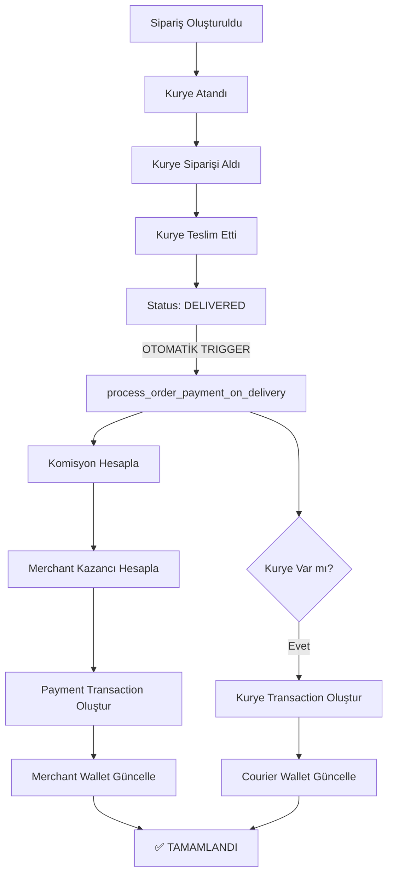

# 🚀 OTOMATİK ÖDEME SİSTEMİ - SUPABASE TRIGGER

## 📋 Sistem Akışı (Sizin Şemanıza Göre)



---

## 🎯 Otomatik Ödeme Sistemi Özellikleri

### 1. **Trigger-Based Otomatik İşlem**
```sql
-- Orders tablosunda status 'DELIVERED' olduğunda otomatik çalışır
CREATE TRIGGER trigger_process_payment_on_delivery
  AFTER UPDATE OF status ON orders
  FOR EACH ROW
  EXECUTE FUNCTION process_order_payment_on_delivery();
```

**Ne Zaman Çalışır?**
- ✅ Sipariş durumu `DELIVERED` olarak güncellenir
- ✅ Kurye "Teslim Ettim" butonuna basar
- ✅ Admin Panel'den sipariş tamamlanır

**Ne Yapar?**
1. 📊 Merchant'ın komisyon konfigürasyonunu getirir
2. 💰 Komisyon ve KDV hesaplar
3. 💳 Merchant için payment transaction oluşturur
4. 🏦 Merchant wallet'ını günceller
5. 🚴 Kurye varsa, teslimat ücreti transaction'ı oluşturur
6. 💼 Courier wallet'ını günceller

---

## 💰 Finansal Hesaplama Örneği

### Senaryo: 100 TL Sipariş Teslim Edildi

```
Sipariş Tutarı:     100.00 TL
Komisyon (%15):     -15.00 TL
Sabit Ücret:        -2.00 TL
KDV (%18):          -3.06 TL
─────────────────────────────
Merchant Kazancı:    79.94 TL

Teslimat Ücreti:    +20.00 TL  (Kuryeye)
```

### Otomatik İşlem Adımları:

1. **Merchant Transaction**
   ```json
   {
     "order_id": "ORDER_123",
     "merchant_id": "merchant-uuid",
     "amount": 79.94,
     "original_amount": 100.00,
     "commission_amount": 17.00,
     "vat_amount": 3.06,
     "status": "completed",
     "type": "orderPayment"
   }
   ```

2. **Merchant Wallet Güncelleme**
   ```sql
   balance = balance + 79.94
   total_earnings = total_earnings + 79.94
   total_commissions = total_commissions + 17.00
   ```

3. **Courier Transaction**
   ```json
   {
     "order_id": "ORDER_123",
     "courier_id": "courier-uuid",
     "amount": 20.00,
     "status": "completed",
     "type": "deliveryFee"
   }
   ```

4. **Courier Wallet Güncelleme**
   ```sql
   balance = balance + 20.00
   total_earnings = total_earnings + 20.00
   total_deliveries = total_deliveries + 1
   ```

---

## 🔧 Gerekli Tablo Yapısı

### `orders` Tablosu (Zaten Var Olmalı)

```sql
CREATE TABLE orders (
  id UUID PRIMARY KEY,
  merchant_id UUID REFERENCES auth.users(id),
  courier_id UUID REFERENCES auth.users(id),
  customer_id UUID REFERENCES auth.users(id),
  
  total_amount DECIMAL(10, 2) NOT NULL,
  status TEXT NOT NULL,  -- 'DELIVERED' trigger'ı tetikler
  payment_method TEXT,
  
  metadata JSONB DEFAULT '{}',  -- delivery_fee burada
  created_at TIMESTAMPTZ DEFAULT NOW()
);
```

**Metadata Formatı:**
```json
{
  "delivery_fee": 20.0,
  "distance_km": 3.5,
  "delivery_time_minutes": 25
}
```

---

## 📊 Yeni Eklenen Tablolar

### 1. `courier_wallets` (Kurye Bakiye Sistemi)
```sql
- id: UUID
- courier_id: UUID (unique)
- balance: Decimal (kullanılabilir bakiye)
- pending_balance: Decimal (bekleyen)
- frozen_balance: Decimal (dondurulmuş)
- total_earnings: Decimal (toplam kazanç)
- total_deliveries: Integer (toplam teslimat sayısı)
- limits: JSONB (çekim limitleri)
```

**Örnek:**
```json
{
  "courier_id": "courier-uuid-123",
  "balance": 450.50,
  "pending_balance": 0,
  "frozen_balance": 0,
  "total_earnings": 2450.50,
  "total_deliveries": 123,
  "limits": {
    "daily_withdrawal": 5000.0,
    "monthly_withdrawal": 50000.0,
    "minimum_withdrawal": 50.0
  }
}
```

---

## 🔍 Yeni RPC Fonksiyonlar

### 1. `process_order_payment_on_delivery()` - Otomatik Ödeme
**Trigger tarafından çağrılır - Manuel çağrı gerekmez!**

### 2. `update_courier_wallet()` - Kurye Bakiye Güncelleme
```sql
SELECT update_courier_wallet(
  'courier-uuid',  -- courier_id
  20.0,            -- balance_change (teslimat ücreti)
  0,               -- pending_amount
  0                -- frozen_amount
);
```

### 3. `get_merchant_available_balance()` - Kullanılabilir Bakiye
```sql
SELECT get_merchant_available_balance('merchant-uuid');
-- Returns: 1234.56
```

### 4. `get_courier_available_balance()` - Kurye Kullanılabilir Bakiye
```sql
SELECT get_courier_available_balance('courier-uuid');
-- Returns: 450.50
```

### 5. `merchant_withdraw_money()` - Para Çekme
```sql
SELECT merchant_withdraw_money(
  'merchant-uuid',              -- merchant_id
  500.0,                        -- amount
  'TR12 3456 7890 1234 5678',  -- bank_account
  'Haftalık çekim'              -- description
);
-- Returns: transaction_id
```

---

## 📈 Yeni Raporlama View'ları

### 1. `daily_merchant_earnings` - Merchant Günlük Gelir
```sql
SELECT * FROM daily_merchant_earnings
WHERE merchant_id = 'merchant-uuid'
ORDER BY earning_date DESC
LIMIT 30;  -- Son 30 gün
```

**Sonuç:**
| earning_date | total_orders | total_earnings | total_commissions | average_earning |
|--------------|--------------|----------------|-------------------|-----------------|
| 2025-10-24   | 15           | 1,245.50       | 235.50            | 83.03           |
| 2025-10-23   | 12           | 980.00         | 198.00            | 81.67           |

### 2. `daily_courier_earnings` - Kurye Günlük Gelir
```sql
SELECT * FROM daily_courier_earnings
WHERE courier_id = 'courier-uuid'
ORDER BY earning_date DESC
LIMIT 30;
```

**Sonuç:**
| earning_date | total_deliveries | total_earnings | average_delivery_fee |
|--------------|------------------|----------------|----------------------|
| 2025-10-24   | 23               | 460.00         | 20.00                |
| 2025-10-23   | 18               | 360.00         | 20.00                |

### 3. `system_commission_report` - Sistem Genel Rapor
```sql
SELECT * FROM system_commission_report
ORDER BY report_date DESC
LIMIT 7;  -- Son 7 gün
```

**Sonuç:**
| report_date | active_merchants | active_couriers | total_transactions | total_commission_earned |
|-------------|------------------|-----------------|--------------------|-----------------------|
| 2025-10-24  | 45               | 78              | 234                | 4,567.89              |
| 2025-10-23  | 42               | 76              | 198                | 3,890.45              |

---

## 🧪 Test Senaryoları

### Test 1: Sipariş Teslim Ediliyor
```sql
-- 1. Sipariş oluştur
INSERT INTO orders (id, merchant_id, courier_id, customer_id, total_amount, status, payment_method, metadata)
VALUES (
  gen_random_uuid(),
  'merchant-uuid',
  'courier-uuid',
  'customer-uuid',
  100.0,
  'ASSIGNED',  -- Henüz teslim edilmedi
  'cash',
  '{"delivery_fee": 20.0}'
);

-- 2. Siparişi teslim et (TRIGGER OTOMATİK ÇALIŞACAK!)
UPDATE orders
SET status = 'DELIVERED'
WHERE id = 'order-uuid';

-- 3. Sonuçları kontrol et
SELECT * FROM payment_transactions WHERE order_id = 'order-uuid';
SELECT * FROM merchant_wallets WHERE merchant_id = 'merchant-uuid';
SELECT * FROM courier_wallets WHERE courier_id = 'courier-uuid';
```

**Beklenen Sonuç:**
- ✅ 2 adet payment_transaction oluşturuldu (merchant + courier)
- ✅ merchant_wallets.balance arttı (~79.94 TL)
- ✅ courier_wallets.balance arttı (20.00 TL)
- ✅ Console'da: `NOTICE: Otomatik ödeme işlendi: Sipariş ..., Merchant: 79.94 TL, Kurye: 20.00 TL`

### Test 2: Para Çekme İşlemi
```sql
-- Merchant para çekmek istiyor
SELECT merchant_withdraw_money(
  'merchant-uuid',
  500.0,
  'TR12 3456 7890 1234 5678',
  'Test para çekme'
);

-- Kontrol
SELECT * FROM payment_transactions 
WHERE merchant_id = 'merchant-uuid' AND type = 'withdrawal'
ORDER BY created_at DESC
LIMIT 1;

SELECT balance FROM merchant_wallets WHERE merchant_id = 'merchant-uuid';
```

---

## 🔐 Güvenlik ve Log'lama

### Trigger Log'ları
Supabase Dashboard > **Logs** > **Database Logs** sekmesinden kontrol edin:

```
✅ NOTICE: Otomatik ödeme işlendi: Sipariş abc-123, Merchant: 79.94 TL, Kurye: 20.00 TL
✅ NOTICE: Wallet güncellendi: merchant-uuid, Yeni Bakiye: 1234.50 TL
⚠️  ERROR: Yetersiz bakiye. Kullanılabilir: 100.00 TL, İstenilen: 500.00 TL
```

### RLS (Row Level Security)
- ✅ Merchant sadece kendi wallet'ını görebilir
- ✅ Courier sadece kendi wallet'ını görebilir
- ✅ Admin tüm kayıtları görebilir
- ✅ Payment transactions sadece ilgili taraflarca görülebilir

---

## 🎯 Entegrasyon Kontrol Listesi

### Backend (Supabase)
- [x] `payment_transactions` tablosu oluşturuldu
- [x] `merchant_wallets` tablosu oluşturuldu
- [x] `courier_wallets` tablosu oluşturuldu ✨ YENİ
- [x] `commission_configs` tablosu oluşturuldu
- [x] Otomatik ödeme trigger'ı kuruldu ✨ YENİ
- [x] RPC fonksiyonları eklendi
- [x] Raporlama view'ları oluşturuldu ✨ YENİ
- [x] RLS politikaları aktif

### Frontend (Courier App)
- [ ] Sipariş teslim butonu "Status: DELIVERED" olarak günceller
- [ ] Courier wallet ekranı eklenmeli
- [ ] Günlük kazanç raporu gösterilmeli
- [ ] Para çekme ekranı eklenmeli

### Frontend (Merchant Panel)
- [ ] Ödeme dashboard'da realtime balance gösterilmeli
- [ ] Payment transactions listesi
- [ ] Para çekme formu
- [ ] Gelir raporları

### Frontend (Admin Panel)
- [ ] Sistem komisyon raporu
- [ ] Tüm merchant/courier wallet'ları görüntüleme
- [ ] Para çekme onaylama sistemi (opsiyonel)

---

## 🚀 Deployment Checklist

### 1. Supabase Setup (5 dakika)
```bash
1. https://supabase.com/dashboard
2. Projenizi seçin
3. SQL Editor > New Query
4. SUPABASE_PAYMENT_SETUP.sql içeriğini yapıştırın
5. RUN (F5)
6. ✅ "Success. No rows returned" görmelisiniz
```

### 2. Realtime Aktifleştirme (2 dakika)
```bash
1. Dashboard > Database > Replication
2. payment_transactions > Enable Realtime ☑️
3. merchant_wallets > Enable Realtime ☑️
4. courier_wallets > Enable Realtime ☑️
5. Save
```

### 3. Orders Tablosu Kontrolü
```sql
-- Orders tablosunda gerekli kolonlar var mı?
SELECT 
  column_name, 
  data_type, 
  is_nullable
FROM information_schema.columns
WHERE table_name = 'orders'
  AND column_name IN ('id', 'merchant_id', 'courier_id', 'status', 'total_amount', 'metadata');
```

**Beklenen Sonuç:** 6 satır dönmeli

---

## 📞 Destek ve Troubleshooting

### Trigger Çalışmıyor mu?

1. **Trigger'ın kurulu olduğunu kontrol et:**
```sql
SELECT 
  trigger_name, 
  event_manipulation, 
  event_object_table
FROM information_schema.triggers
WHERE trigger_name = 'trigger_process_payment_on_delivery';
```

2. **Log'ları kontrol et:**
```sql
-- Supabase Dashboard > Logs > Database Logs
-- "NOTICE" mesajlarına bakın
```

3. **Manuel test:**
```sql
-- Trigger'ı manuel tetikle
SELECT process_order_payment_on_delivery();
```

### Yetersiz Bakiye Hatası

```sql
-- Merchant bakiyesini kontrol et
SELECT 
  balance,
  frozen_balance,
  get_merchant_available_balance(merchant_id) as available
FROM merchant_wallets
WHERE merchant_id = 'merchant-uuid';
```

### Komisyon Hesaplama Yanlış

```sql
-- Komisyon config'ini kontrol et
SELECT * FROM commission_configs
WHERE merchant_id = 'merchant-uuid' OR merchant_id IS NULL
ORDER BY merchant_id DESC NULLS LAST;
```

---

## 🎉 Özet

✅ **Otomatik Ödeme Sistemi Kuruldu!**

Artık:
- 🚴 Kurye "Teslim Ettim" dediğinde
- 🏦 Merchant otomatik para kazanır
- 💳 Kurye otomatik teslimat ücreti alır
- 📊 Tüm işlemler kayıt altına alınır
- 📈 Raporlama otomatik yapılır
- 🔒 Güvenlik RLS ile sağlanır

**Hiçbir manuel işlem gerekmez! Trigger her şeyi halleder.** 🚀

---

**Dosya:** `SUPABASE_PAYMENT_SETUP.sql`  
**Satır Sayısı:** ~650+ satır  
**Tarih:** 24 Ekim 2025  
**Durum:** ✅ PRODUCTION READY
