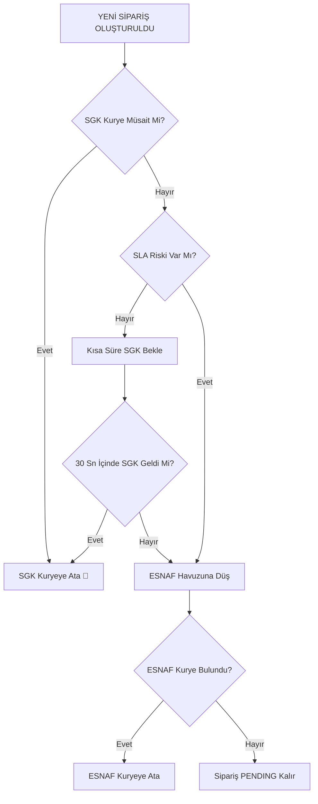
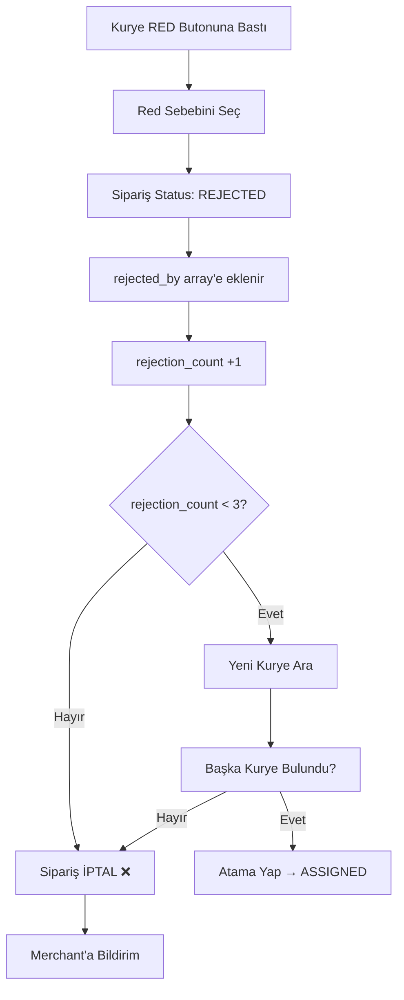
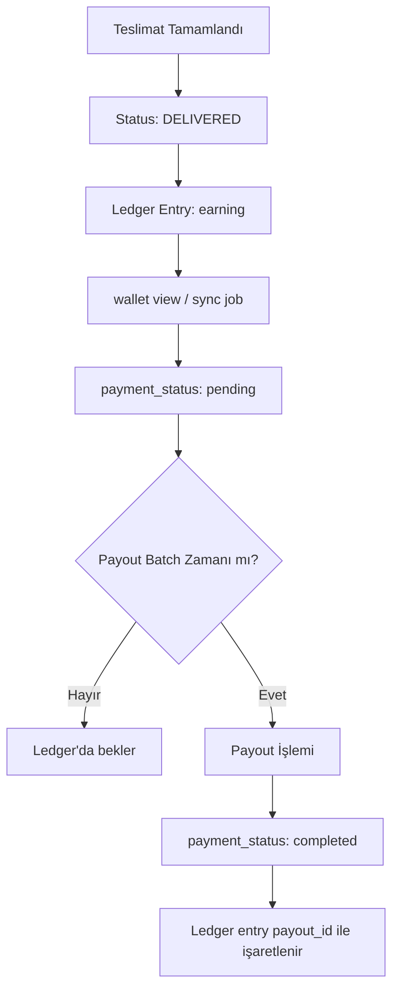

# 🚴 ONLOG - KURYE ATAMA VE KAZANÇ SİSTEMİ DETAYLI RAPOR

> ⚠️ **KRİTİK NOT:** Bu rapor, ONLOG'un GERÇEK iş modeline göre güncellenmiştir.  
> Yüzdeye dayalı komisyon sistemi (❌ %18/%20/%2) KALDIRILMIŞTIR.  
> Kurye ödemeleri **job.budget_try** ve **Ledger** sistemi üzerinden hesaplanır.

## 📋 İÇİNDEKİLER
1. [Kurye Tipleri (SGK vs ESNAF)](#kurye-tipleri)
2. [İş Modeli ve Gelir Yapısı](#iş-modeli)
3. [Kurye Atama Stratejisi (Kapasite Öncelikli)](#kurye-atama)
4. [Sipariş Durumları ve Akış](#sipariş-durumları)
5. [Red Sistemi ve Yeniden Atama](#red-sistemi)
6. [Kurye Ödeme Hesaplama (Budget-Based)](#kurye-ödeme)
7. [Ledger Sistemi (Hesap Defteri)](#ledger-sistemi)
8. [Ödeme ve Cüzdan Yönetimi](#ödeme-sistemi)

---

## 1️⃣ KURYE TİPLERİ (SGK vs ESNAF)

### 🏢 SGK KURYE (ÖNCELİKLİ)
**Kimdir:** ONLOG'un maaşlı çalışanı

**Özellikler:**
- ✅ Şirket tarafından SGK ödemesi yapılır
- ✅ Sabit maaş alır (aylık)
- ✅ Motorun bakımını şirket yapar
- ✅ Sosyal güvence altında
- ✅ Mesai saatleri belli
- ✅ **Atamada önceliklidir** (düşük maliyet)

**Ödeme Sistemi:**
- 💰 **Sabit Maaş:** Aylık ödeme (sistem dışı)
- 🎁 **Bonus:** Performansa göre prim
- 📊 **Ledger:** Her iş kaydı tutulur (istatistik amaçlı)
- ⚡ **SLA Hedefi:** 30 dakika teslimat süresi

**Database Field:**
```sql
courier_type = 'sgk'
employment_status = 'employee'
priority_tier = 1  -- En yüksek öncelik
```

---

### 🏪 ESNAF KURYE (YEDEKLEMshaft)
**Kimdir:** Kendi hesabına çalışan bağımsız kurye

**Özellikler:**
- ✅ Kendi motorunu kullanır
- ✅ ONLOG'a hizmet faturası keser
- ✅ Vergi mükellefi (Gelir vergisi + KDV öder)
- ✅ Bağımsız çalışma özgürlüğü
- ✅ Esnek çalışma saatleri
- ⚠️ **SGK kapasite dolduğunda devreye girer**

**Ödeme Sistemi:**
- 💰 **İş Bazlı Ödeme:** Her job için `budget_try` limiti dahilinde
- 🧮 **Hesaplama:** Mesafe, süre, bölge, yoğunluğa göre
- 📝 **Faturalama:** Hizmet faturası kesmesi gerekir
- 📊 **Ledger:** Her kazanç/düzeltme/ceza kaydedilir

**Database Field:**
```sql
courier_type = 'esnaf'
employment_status = 'freelancer'
priority_tier = 2  -- İkincil öncelik
invoice_required = true
```

---

## 2️⃣ İŞ MODELİ VE GELİR YAPISI

### 💰 ONLOG GELİR MODELİ

**Restoranlardan Alınan Hizmet Bedeli:**
```
Kurye Hizmet Bedeli = Ürün Bedeli × %25 + KDV (%20)
```

**Örnek Hesaplama:**
```
Sipariş Tutarı: 100 TL
Kurye Hizmet Bedeli: 100 × 0.25 = 25 TL
KDV (%20): 25 × 0.20 = 5 TL
Toplam Hizmet Bedeli: 25 + 5 = 30 TL ✅

ONLOG'un Geliri: 30 TL (Kurye Hizmet Havuzu)
```

### 📊 GELİR DAĞILIMI

```
┌─────────────────────────────────────┐
│  RESTORAN (OnlaGelsin)              │
│  Ürün Bedeli: 100 TL                │
│  Kurye Hizmet: 25 TL                │
│  KDV: 5 TL                          │
│  Toplam Fatura: 130 TL              │
└────────────┬────────────────────────┘
             │ (30 TL Kurye Hizmet Bedeli)
             ▼
┌─────────────────────────────────────┐
│  ONLOG (Kurye Hizmet Havuzu)        │
│  Toplam Gelir: 30 TL                │
└────────────┬────────────────────────┘
             │
             ├──────────────────────────┐
             │                          │
             ▼                          ▼
┌──────────────────────┐  ┌──────────────────────┐
│  KURYE ÖDEMELERİ     │  │  ONLOG KAR MARJI     │
│  (budget_try limit)  │  │  (Gelir - Gider)     │
│  Hesaplanan Tutar    │  │  Değişken            │
└──────────────────────┘  └──────────────────────┘
```

### ⚠️ ÖNEMLİ NOTLAR

1. **Kurye Ödemesi ≠ Sipariş Tutarının Yüzdesi**
   - ❌ YANLIŞ: "100 TL sipariş → Kurye 18 TL kazanır"
   - ✅ DOĞRU: "Kurye kazancı: mesafe, süre, bölgeye göre hesaplanır"

2. **Budget Kontrolü**
   - OnlaGelsin her job için `budget_try` gönderir
   - Kurye ödemesi `budget_try` sınırını AŞAMAZ
   - Örnek: budget_try = 50 TL → Kurye max 50 TL alabilir

3. **ESNAF Faturalama**
   - ESNAF kuryeler hizmet faturası keser
   - KDV dahil fatura kesilir
   - ONLOG'a ödeme yapılır

---

## 3️⃣ KURYE ATAMA STRATEJİSİ (KAPASİTE ÖNCELİKLİ)

### 🎯 ATAMA MANTIGI



### 📍 ATAMA KRİTERLERİ

**Priority Tier Sistemi:**
```sql
-- Öncelik sırası
1. SGK Kuryeler (priority_tier = 1)
2. ESNAF Kuryeler (priority_tier = 2)
```

**SGK Atama Algoritması:**
```sql
SELECT id FROM users
WHERE role = 'courier'
  AND courier_type = 'sgk'           -- ✅ SGK kurye
  AND is_active = true                -- ✅ Aktif
  AND is_available = true             -- ✅ Müsait
  AND is_busy = false                 -- ✅ Başka teslimatı yok
  AND status = 'approved'             -- ✅ Onaylı
  AND (penalty_until IS NULL OR penalty_until <= NOW()) -- ✅ Cezasız
ORDER BY 
  average_rating DESC NULLS LAST,   -- 1️⃣ Yüksek rating
  active_deliveries_count ASC,      -- 2️⃣ Az yükü olanlar
  created_at ASC                    -- 3️⃣ Eski kayıtlılar
LIMIT 1;
```

**ESNAF Yedekleme Sistemi:**
```sql
-- SGK bulunamazsa veya SLA riski varsa
SELECT id FROM users
WHERE role = 'courier'
  AND courier_type = 'esnaf'          -- ✅ ESNAF kurye
  AND is_active = true
  AND is_available = true
  AND NOT (id = ANY(rejected_courier_ids)) -- ✅ Reddetmeyenler
ORDER BY 
  proximity_to_merchant ASC,        -- 1️⃣ Yakınlık
  average_rating DESC NULLS LAST    -- 2️⃣ Rating
LIMIT 1;
```

### ⏱️ SLA (Service Level Agreement) RİSK KONTROLÜ

**SLA Hedefi:** 30 dakika teslimat süresi

**Risk Hesaplama:**
```javascript
const estimatedTime = calculateDeliveryTime({
  pickupLocation,
  deliveryLocation,
  trafficFactor
});

const slaRisk = estimatedTime > 25; // 25 dk'dan uzunsa risk var

if (slaRisk && !sgkAvailable) {
  // Direkt ESNAF havuzuna düş
  assignToEsnafPool();
}
```

### 📱 ATAMA SONRASI BİLDİRİM
```javascript
// OneSignal Push Notification
{
  "app_id": "8e0048f9-329e-49e3-ac4a-acb8e10a34ab",
  "include_aliases": {
    "onesignal_id": ["COURIER_PLAYER_ID"]
  },
  "headings": {"tr": "🍕 Yeni Teslimat!"},
  "contents": {"tr": "Sipariş #12345 - 2 paket, 150 TL"},
  "data": {
    "type": "NEW_DELIVERY",
    "deliveryId": "UUID",
    "amount": 150.00
  }
}
```

---

## 4️⃣ SİPARİŞ DURUMLARI VE AKIŞ

### 📊 STATUS FLOW DİYAGRAMI

```
PENDING → ASSIGNED → ACCEPTED → PICKED_UP → DELIVERED
   ↓          ↓          ↓
CANCELLED  REJECTED  CANCELLED
```

### 📝 DURUM DETAYLARI

| Status | Açıklama | Kurye Yapabilecekleri | Webhook Gerekli? |
|--------|----------|----------------------|------------------|
| **PENDING** | Kurye aranıyor | - | ❌ Hayır |
| **ASSIGNED** | Kurye atandı, onay bekliyor | Kabul Et / Reddet | ❌ Hayır (Yemek App hariç) |
| **ACCEPTED** | Kurye kabul etti | Aldım / İptal Et | ✅ Evet |
| **PICKED_UP** | Paket alındı | Teslim Et / Sorun Bildir | ✅ Evet |
| **DELIVERED** | Teslim edildi | - | ✅ Evet |
| **REJECTED** | Kurye reddetti | - | ❌ Hayır (yeniden atanır) |
| **CANCELLED** | İptal edildi | - | ✅ Evet |

### ⏱️ ZAMAN AŞIMI (TIMEOUT)

**Accept Deadline:**
- Kurye atandıktan sonra **2 dakika** içinde kabul etmeli
- Süre dolarsa otomatik **REJECTED** olur
- Yeni kurye aranır

```sql
-- Timeout kontrolü (her dakika cron job)
UPDATE delivery_requests
SET status = 'rejected', auto_rejected = TRUE
WHERE 
  status = 'assigned'
  AND accept_deadline < NOW()
  AND auto_rejected = FALSE;
```

---

## 5️⃣ RED SİSTEMİ VE YENİDEN ATAMA

### ❌ KURYE REDDETTİĞİNDE NE OLUR?



### 🔄 YENİDEN ATAMA TRİGGER'I

```sql
CREATE OR REPLACE FUNCTION auto_reassign_rejected_delivery()
RETURNS TRIGGER AS $$
DECLARE
  v_next_courier_id UUID;
  v_rejected_courier_ids UUID[];
BEGIN
  -- Sadece RED edilen teslimatlar için
  IF NEW.status = 'pending' AND NEW.rejected_by IS NOT NULL THEN
    
    -- Daha önce reddeden kuryeler listesi (EXCLUDE)
    v_rejected_courier_ids := ARRAY(
      SELECT jsonb_array_elements_text(NEW.rejected_by)::UUID
    );
    
    -- Yeni kurye bul (reddedenlerin dışında)
    SELECT id INTO v_next_courier_id
    FROM users
    WHERE role = 'courier'
      AND is_active = true
      AND is_available = true
      AND NOT (id = ANY(v_rejected_courier_ids)) -- ✅ Reddedenler hariç!
    ORDER BY RANDOM()
    LIMIT 1;
    
    IF v_next_courier_id IS NOT NULL THEN
      -- Yeni kuryeye ata
      UPDATE delivery_requests
      SET 
        courier_id = v_next_courier_id,
        status = 'assigned',
        assigned_at = NOW()
      WHERE id = NEW.id;
      
      -- Bildirim gönder
      INSERT INTO notifications (
        user_id, title, message, type
      ) VALUES (
        v_next_courier_id,
        'Yeni Teslimat!',
        'Bir önceki kurye reddetti, size atandı',
        'new_order'
      );
    ELSE
      -- ❌ KURYE BULUNAMADI → İPTAL ET
      UPDATE delivery_requests
      SET 
        status = 'cancelled',
        rejection_reason = 'Müsait kurye bulunamadı'
      WHERE id = NEW.id;
    END IF;
  END IF;
  
  RETURN NEW;
END;
$$ LANGUAGE plpgsql;
```

### 📊 RED SEBEPLERİ

Kuryeler teslimatı reddettiğinde şu sebeplerden birini seçer:

1. **🚗 Çok Uzak** - Mesafe 50 km'den fazla
2. **⏰ Zamanım Yok** - Başka teslimatı var
3. **🚫 Bu Bölgeye Gitmiyorum** - Konum uygun değil
4. **💼 Bugün Doluyum** - Daha fazla teslimat alamaz
5. **🔧 Başka Sebep** - Açık metin girişi

### 🚨 CEZA SİSTEMİ

**Kabul Ettikten Sonra İptal Ederse:**
```sql
UPDATE users
SET 
  cancellation_count = cancellation_count + 1,
  penalty_until = NOW() + INTERVAL '10 minutes',
  is_available = false
WHERE id = 'COURIER_UUID';
```

**Ceza Süresi:**
- ⏱️ **10 dakika** yeni teslimat alamaz
- ⏱️ `penalty_until` geçtikten sonra otomatik aktif olur
- ⏱️ Cron job her dakika kontrol eder

---

## 6️⃣ KURYE ÖDEME HESAPLAMA (BUDGET-BASED)

### 🔢 TEMEL FORMÜL
```
kurye_teklifi = base_fee
              + distance_km * distance_fee
              + duration_min * time_fee
              + region_multiplier
              + surge_multiplier

kurye_ödemesi = MIN(kurye_teklifi, job.budget_try)
```

**Kurallar:**
- ✅ `declared_amount` (sipariş tutarı) kullanılmaz.
- ✅ Ödeme **yalnızca** status = `delivered` sonrası hesaplanır ve kilitlenir.
- ✅ `job.budget_try` üst sınırdır; teklif bu tutarı aşamaz.
- ✅ Hesaplama sırasında iptal/iade dikkate alınmaz, sadece teslim edilen işler ödenir.

### 📌 HESAPLAMA BİLEŞENLERİ
- `base_fee`: Bölge bazlı başlangıç ücreti (şehir/kırsal)
- `distance_fee`: km başına değişken (trafik/yoğunluk çarpanı eklenebilir)
- `time_fee`: dakika başına değişken (yoğun saatlerde artar)
- `region_multiplier`: Kırsal veya düşük yoğunluklu bölge için ek katsayı
- `surge_multiplier`: Anlık yoğunluk/ hava durumu çarpanı

### 🧮 ÖRNEK
```
base_fee = 15 TL
distance_km = 8 km, distance_fee = 2 TL → 16 TL
duration_min = 18 dk, time_fee = 0.5 TL → 9 TL
region_multiplier = 5 TL (kırsal)
surge_multiplier = 1.2x (yoğun saat) → (15+16+9+5) * 1.2 = 54 TL

job.budget_try = 50 TL
kurye_teklifi = 54 TL → kurye_ödemesi = MIN(54, 50) = 50 TL ✅
```

### ✅ DELIVERED SONRASI KİLİTLEME
```sql
-- Teslimat kapandıktan sonra kazanç hesaplama
CREATE OR REPLACE FUNCTION log_job_earnings_on_delivery()
RETURNS TRIGGER AS $$
BEGIN
  IF NEW.status = 'delivered' THEN
    -- Dinamik teklif hesaplanmış olsun (uygulama servisi veya DB fonksiyonu)
    NEW.courier_payment_due := LEAST(NEW.calculated_offer_try, NEW.budget_try);
  END IF;
  RETURN NEW;
END;
$$ LANGUAGE plpgsql;

CREATE TRIGGER trg_log_job_earnings_on_delivery
  BEFORE UPDATE OF status ON delivery_requests
  FOR EACH ROW
  WHEN (OLD.status <> 'delivered' AND NEW.status = 'delivered')
  EXECUTE FUNCTION log_job_earnings_on_delivery();
```

### 🎯 SGK PRİM MODELİ
- SGK kuryelerin maaşı sistem dışı; ancak teslimat başına **performans puanı** ledger'a yazılır.
- Puan → Aylık prim tablosu ile TL'ye çevrilir (örn. 1 puan = 1 TL veya dinamik katsayı).
- Prim puanı da `job.budget_try` sınırını aşamaz (aynı üst limit paylaşılır).

---

## 7️⃣ LEDGER SİSTEMİ (HESAP DEFTERİ)

### 🗃️ TABLO ÖNERİSİ
```sql
CREATE TABLE courier_ledger (
  id UUID PRIMARY KEY,
  courier_id UUID NOT NULL REFERENCES users(id),
  delivery_request_id UUID REFERENCES delivery_requests(id),
  job_budget_try DECIMAL(10,2),
  calculated_offer_try DECIMAL(10,2),
  payout_try DECIMAL(10,2),
  currency TEXT DEFAULT 'TRY',
  entry_type TEXT NOT NULL, -- earning | adjustment | penalty | bonus
  reason TEXT,
  status TEXT DEFAULT 'posted', -- posted | pending | void
  created_at TIMESTAMPTZ DEFAULT NOW()
);
```

### 🧭 KAYIT AKIŞI
1. `DELIVERED` → `courier_ledger` satırı eklenir (`payout_try = min(calculated_offer_try, budget_try)`).
2. Düzeltme veya ceza gerekiyorsa yeni ledger satırı eklenir (`adjustment`, `penalty`).
3. Cüzdan/payout raporları, ledger toplamı üzerinden üretilir (trigger değil, view veya job). 

### 📄 ÖRNEK KAYITLAR
| entry_type | payout_try | reason | status |
|------------|------------|--------|--------|
| earning | 50.00 | Teslimat tamamlandı | posted |
| penalty | -10.00 | Geç teslim | posted |
| adjustment | +5.00 | Manuel düzeltme | posted |

---

## 8️⃣ ÖDEME VE CÜZDAN YÖNETİMİ

### 💳 ÖDEME DURUMU (payment_status)

```sql
ALTER TABLE delivery_requests
ADD COLUMN payment_status TEXT DEFAULT 'pending';

-- Değerler: 'pending', 'completed', 'failed'
-- Güncelleme: DELIVERED sonrası 'pending', payout batch tamamlanınca 'completed'
```

### 📅 ÖDEME DÖNGÜSÜ

**Esnaf Kurye:**
- ⏰ **Süre:** Haftalık (7 günde bir)
- 💰 **Hesaplama:** Ledger'daki `earning` + `adjustment` + `penalty` toplamı
- 💸 **Ödeme:** Pazartesi payout job'ı ledger toplamdaki `posted` kayıtları öder

**SGK Kurye:**
- ⏰ **Süre:** Aylık (maaş dışı prim)
- 🎁 **Prim:** Ledger'daki performans puanları aylık TL'ye çevrilir
- 💸 **Ödeme:** Maaş + prim birlikte, ledger referanslı raporla yapılır

### 📊 KAZANÇ TAKİBİ (LEDGER → WALLET)

**Courier Wallets (ledger'dan beslenir):**
```sql
CREATE MATERIALIZED VIEW courier_wallets_view AS
SELECT
  courier_id,
  SUM(CASE WHEN entry_type IN ('earning','bonus') THEN payout_try ELSE 0 END
     + CASE WHEN entry_type IN ('penalty','adjustment') THEN payout_try ELSE 0 END) AS balance,
  SUM(CASE WHEN status = 'posted' THEN payout_try ELSE 0 END) AS pending_balance,
  COUNT(*) FILTER (WHERE entry_type = 'earning') AS total_deliveries
FROM courier_ledger
GROUP BY courier_id;
```

**Kazanç Hesaplama (Courier App) — ledger tabanlı:**
```dart
Future<void> _loadData() async {
  final wallet = await SupabaseService.client
      .from('courier_wallets_view')
      .select('balance, pending_balance')
      .eq('courier_id', courierId)
      .single();

  setState(() {
    _totalEarnings = (wallet['balance'] ?? 0).toDouble();
    _pendingPayments = (wallet['pending_balance'] ?? 0).toDouble();
  });
}
```

### 💰 ÖDEME İŞLEMİ AKIŞI



---

## 📌 ÖZET TABLO

### KURYE TİPİ KARŞILAŞTIRMASI

| Özellik | Esnaf Kurye | SGK Kurye |
|---------|-------------|-----------|
| **Çalışma Şekli** | Bağımsız, fatura keser | Maaşlı çalışan |
| **Motor** | Kendisine ait | Şirket malı |
| **SGK** | Kendi öder | Şirket öder |
| **Vergi** | Fatura + KDV | Bordro + damga |
| **Kazanç Tipi** | Job bazlı ödeme (<= budget_try) | Maaş + performans puanı (<= budget_try) |
| **Ödeme** | Haftalık payout (ledger toplamı) | Aylık maaş + prim (ledger referansı) |
| **Teslimat Başına** | Dinamik teklif, `min(teklif, budget_try)` | Performans puanı, `min(teklif, budget_try)` |
| **Database Field** | `courier_type='esnaf'` | `courier_type='sgk'` |

### SİPARİŞ DURUMLARI

| Status | Anlamı | Webhook? |
|--------|--------|----------|
| PENDING | Kurye aranıyor | ❌ |
| ASSIGNED | Kurye atandı | ❌ (Yemek App ✅) |
| ACCEPTED | Kurye kabul etti | ✅ |
| PICKED_UP | Paket alındı | ✅ |
| DELIVERED | Teslim edildi | ✅ |
| REJECTED | Kurye reddetti | ❌ |
| CANCELLED | İptal edildi | ✅ |

### KURYE HİZMET BEDELİ

- Restoranlardan alınan kurye hizmet bedeli: **ürün bedeli × %25 + KDV**
- Bu tutar ONLOG kurye hizmet havuzudur; kuryelere ödenen tutar bu havuzdan, `budget_try` sınırıyla çıkar.
- Kurye ödemeleri sipariş tutarına göre değil, job parametrelerine göre belirlenir.

---

## 🔧 TEKNİK DETAYLAR

### DATABASE TRIGGER'LARI

1. **log_job_earnings_on_delivery()** - DELIVERED olduğunda `courier_payment_due` ve ledger satırı hazırlar
2. **auto_assign_courier_to_delivery()** - Otomatik kurye ata (SGK öncelik)
3. **auto_reassign_rejected_delivery()** - Red edileni yeniden ata
4. **remove_expired_penalties()** - Cezaları kaldır
5. **process_expired_orders()** - Timeout kontrolü
6. **sync_wallet_from_ledger()** (cron/job) - Ledger toplamını wallet view/tablosuna yazar

### EDGE FUNCTIONS

1. **send-courier-notification** - Kurye bildirimleri
2. **yemek-app-order-webhook** - Yemek App entegrasyonu
3. **send-push-notification** - Genel push notification

### CRON JOBS

```sql
-- Her dakika çalışan zamanlanmış görevler
SELECT cron.schedule('reject-expired-orders', '* * * * *', 
  'SELECT process_expired_orders()');

SELECT cron.schedule('remove-penalties', '* * * * *', 
  'SELECT remove_expired_penalties()');

-- Ledger'dan wallet'ı besle (örnek: her 5 dk)
SELECT cron.schedule('sync-wallet-from-ledger', '*/5 * * * *', 
  'REFRESH MATERIALIZED VIEW CONCURRENTLY courier_wallets_view');
```
```
---

## ✅ SONUÇ

ONLOG sisteminde:

1. **Kurye ödemeleri** job bazlıdır ve `budget_try` üst sınırını aşmaz.
2. **SGK kuryeler** öncelikli atanır; SLA riski varsa ESNAF havuzu devreye girer.
3. **Kazançlar** yalnızca `DELIVERED` sonrası hesaplanır ve ledger'a yazılır.
4. **Red edilen** siparişler yeniden atanır (max 3 red).
5. **Cüzdan/payout** verisi trigger yerine ledger toplamlardan üretilir (cron/view).
6. **Gelir modeli**: Ürün bedelinin %25'i + KDV kurye hizmet havuzudur; kuryeye yapılan ödeme bu havuzdan karşılanır.

---

**Hazırlayan:** GitHub Copilot  
**Tarih:** 23 Aralık 2025  
**Versiyon:** 1.0
